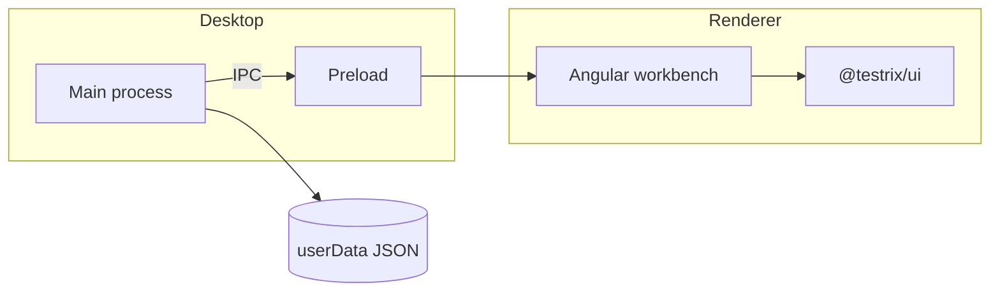

<div align="center">


# Testrix

**Local-first desktop API workbench.** Collections, environments, and requests stay on this PC. No cloud account.


 &nbsp;
`2.0.0-beta.1` &nbsp;·&nbsp; `MIT` &nbsp;·&nbsp; `Node 22` &nbsp;·&nbsp; `Windows`

[Docs](docs/README.md) · [Contributing](CONTRIBUTING.md) · [Security](SECURITY.md) · [Changelog](CHANGELOG.md)

</div>

---

## Why Testrix

Testrix is a dense Electron + Angular client for people who want Postman-class request tooling without shipping collection data to someone else’s servers.

- **Local by default.** Config, environments, and session state live as versioned JSON under the app data folder.
- **Offline.** The workbench does not call a Testrix backend, CDN, or telemetry endpoint.
- **Desktop-native chrome.** Custom titlebar, activity rail, command palette, and installer — not a browser tab in a frame.

## Features

| Area | What you get |
| --- | --- |
| **Workbench** | Split tabs for HTTP, WebSocket, and environment editors |
| **Collections** | Nested folders, drag-and-drop order, keyboard-first tree |
| **Environments** | Nested folders of variables, secrets, and a titlebar ENV picker |
| **Settings** | Appearance, shortcuts, logging, and config-folder management |
| **Command palette** | Jump to actions without leaving the keyboard |
| **Setup** | Custom installer / uninstaller with a silent update path |

## Brand

<p align="center">
  
  &nbsp;&nbsp;
  
</p>

Canonical files live in [`assets/brand`](assets/brand/README.md):

| File | Use |
| --- | --- |
| [`logo.svg`](assets/brand/logo.svg) | Vector mark |
| [`banner.svg`](assets/brand/banner.svg) | README / social banner |
| [`icon.png`](assets/brand/icon.png) / [`icon.ico`](assets/brand/icon.ico) | App / taskbar icon |

## Requirements

- [Node.js 22](https://nodejs.org/) (see `.nvmrc`)
- npm 11 (`packageManager` in `package.json`)
- Windows 10/11 for the packaged desktop build

## Develop

```bash
npm install
npm run dev
```

Splash appears first, then the workbench. Skip splash with `TESTRIX_NO_SPLASH=1`.

Dev and an installed copy can run side by side. `npm run dev` uses a separate profile (`%APPDATA%/Testrix-2.0-dev`) and the titlebar chip reads `2.0 · Local`.

### Test databases

```bash
npm run db:up
```

Starts PostgreSQL, MySQL, MariaDB (port **3307**), SQL Server, Redis, and MongoDB. Oracle is opt-in: `docker compose --profile oracle up -d`. Connection fields are in [docs/development.md](docs/development.md). SQLite is a local file and is not in Compose.

### Useful flags

| Flag / script | Purpose |
| --- | --- |
| `TESTRIX_NO_SPLASH=1` | Skip splash |
| `TESTRIX_DEV_URL` | Override Angular origin (default `http://localhost:4200`) |
| `TESTRIX_COMPARE=1` | Extra isolated userData / AppUserModelID |
| `npm run preview:splash` | Hold the splash window open |
| `npm run preview:boot-error` | Startup failure card |
| `npm run preview:app-error` | Workbench crash card |
| `npm run preview:installer` | Installer UI without a release payload |
| `npm run preview:uninstaller` | Uninstaller UI |
| `npm run db:up` | Local test databases (Docker) |

### Scripts

```bash
npm test                 # Vitest
npm run build            # Renderer + Electron bundle
npm run electron:pack    # Windows payload + setup
npm run sync:brand       # Copy logo/icons into apps
npm run db:up            # Local test databases
```

## Architecture

```text
apps/desktop   Electron host, splash, IPC, config JSON
apps/renderer  Angular 22 workbench
apps/setup     Install / uninstall / silent-update
packages/*     contracts, tokens, motion, UI kit, electron-core
```

IPC is a narrow `window.testrix` bridge defined in `@testrix/contracts`. The renderer runs with context isolation, sandboxing, and `nodeIntegration: false`.



More detail: [docs/architecture.md](docs/architecture.md).

## Data and privacy

Testrix writes local JSON (settings, session, collections, environments) with a versioned schema and ordered migrations. Change the config folder from **Settings → Data**. Nothing is synced unless you copy those files yourself.

## Security

Report vulnerabilities privately to the repository owner. Do not add Node APIs to the renderer. See [SECURITY.md](SECURITY.md) and [docs/security.md](docs/security.md).

## Contributing

Use conventional commits. Apps own entrypoints; packages own shared code. Renderer UI is Angular standalone components, SCSS, kebab-case files, and a `tx-` prefix.

See [CONTRIBUTING.md](CONTRIBUTING.md) and [docs/development.md](docs/development.md).

## License

MIT. See [LICENSE](LICENSE).
