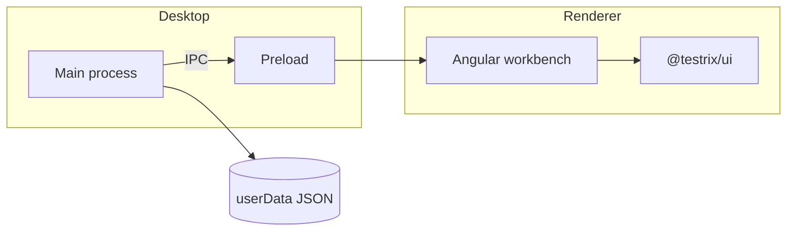

<div align="center">


# Testrix

[](https://github.com/matthiaskopeinigg/testrix/actions/workflows/ci.yml)

**Local-first desktop toolkit for building, testing, and verifying software.** APIs, databases, flows, and regression tools on this PC — no cloud account.

 &nbsp;
`2.0.0` &nbsp;·&nbsp; `MIT` &nbsp;·&nbsp; `Node >=20.11` &nbsp;·&nbsp; `Windows` &nbsp;·&nbsp; `macOS` &nbsp;·&nbsp; `Linux`

[Develop](docs/development.md) · [Release](docs/releasing.md) · [Contributing](CONTRIBUTING.md) · [Security](SECURITY.md) · [Changelog](CHANGELOG.md)

</div>

`assets/brand/logo.svg` is the mark. `npm run sync:brand` copies it and generates icons into the apps.

## Install

Download **Testrix.exe** from [GitHub Releases](https://github.com/matthiaskopeinigg/testrix/releases). Windows builds are **not Authenticode-signed** (no paid code-signing certificate). SmartScreen may show an unknown-publisher warning; that is expected. In-app updates still verify an Ed25519-signed manifest and the SHA-512 of the installer. See [NOTICE](NOTICE) and [docs/releasing.md](docs/releasing.md).

---

## Why Testrix

Testrix is for the people who ship and prove quality every day: developers, testers, SQAs, architects, and anyone else who lives in APIs, data, and regression loops. One desktop app for the jobs those roles already share — design and exercise endpoints, run multi-step flows and regression suites, inspect databases, manage environments, and keep the supporting tools close at hand.

Most “API clients” push you into accounts, sync, and someone else’s cloud. Testrix keeps collections, environments, flows, database sessions, history, and service tools on this machine until you share a workspace. Sharing is opt-in. No signup is required to work locally, and there is no telemetry phone-home.

- **Your data stays put.** Versioned JSON under the app data folder — not a vendor vault.
- **Works offline.** No Testrix backend, CDN, or account gate between you and the work.
- **Built like a desktop app.** Custom titlebar, activity rail, command palette, and a real installer — not a browser shell.

## Requirements

- [Node.js](https://nodejs.org/) **>=20.11.0** (`engines` in `package.json`; CI and local dev use **22.x** from `.nvmrc`)
- npm 11 (`packageManager` in `package.json`)
- Windows, macOS, or Linux for the packaged desktop build

## Develop

```bash
npm install
npm run dev
```

Splash appears first, then the workbench. Skip splash with `TESTRIX_NO_SPLASH=1`.

Dev and an installed copy can run side by side. `npm run dev` uses a separate profile (`%APPDATA%/Testrix-2.0-dev`) and the titlebar chip reads `2.0 · Local`.

### Test databases

```bash
npm run db:up
```

Starts PostgreSQL, MySQL, MariaDB (port **3307**), SQL Server, Redis, and MongoDB. Oracle is opt-in: `docker compose --project-directory docker --profile oracle up -d`. Connection fields are in [docs/development.md](docs/development.md). SQLite is a local file and is not in Compose.

### Useful flags

| Flag / script | Purpose |
| --- | --- |
| `TESTRIX_NO_SPLASH=1` | Skip splash |
| `TESTRIX_DEV_URL` | Override Angular origin (default `http://localhost:4200`) |
| `TESTRIX_COMPARE=1` | Extra isolated userData / AppUserModelID |
| `npm run preview:splash` | Hold the splash window open |
| `npm run preview:boot-error` | Startup failure card |
| `npm run preview:app-error` | Workbench crash card |
| `npm run preview:installer` | Installer UI without a release payload |
| `npm run preview:uninstaller` | Uninstaller UI |
| `npm run db:up` | Local test databases (Docker) |

### Scripts

```bash
npm test                 # Vitest unit specs
npm run test:coverage    # Vitest with coverage floors
npm run test:components  # Angular TestBed (*.component.test.ts)
npm run test:e2e         # Playwright against the built Electron app
npm run verify           # lint, styles, format, typecheck, coverage, components, doc links
npm run test:all         # verify + build + e2e
npm run check:docs       # relative Markdown link check
npm run build            # Renderer + Electron bundle
npm run electron:pack    # Unsigned Windows payload + Setup
npm run sync:brand       # Copy logo/icons into apps
npm run db:up            # Local test databases
```

## Architecture

```text
apps/desktop   Electron host, splash, IPC, config JSON
apps/renderer  Angular 22 workbench
apps/setup     Install / uninstall / silent-update
packages/*     contracts, electron-core, http-engine, ui, design-tokens
```

IPC is a narrow `window.testrix` bridge. The main process validates every payload. The renderer runs with context isolation, sandboxing, and `nodeIntegration: false`. Secrets go in `secrets.local.json`, encrypted with the OS keychain.

Boot: splash → hidden main window → renderer `notifyReady` → workbench.



## Data and privacy

Testrix writes local JSON (settings, session, collections, environments) with a versioned schema and ordered migrations. Change the config folder from **Settings → Data**. Nothing is synced unless you copy those files yourself.

## Support

Press **F1** in the app for features and shortcuts. Bugs and ideas go on GitHub Issues. Vulnerabilities: [SECURITY.md](SECURITY.md). Do not add Node APIs to the renderer.

## Contributing

Use conventional commits. Apps own entrypoints; packages own shared code. Renderer UI is Angular standalone components, SCSS, kebab-case files, and a `tx-` prefix.

See [CONTRIBUTING.md](CONTRIBUTING.md) and [docs/development.md](docs/development.md).

## Features

| Area | What you get |
| --- | --- |
| **Workbench** | Tabs for HTTP, WebSocket, flows, database, and environments |
| **Collections** | Nested folders, drag-and-drop order, keyboard-first tree |
| **Environments** | Folders of variables and secrets, plus a titlebar ENV picker |
| **Services** | Flows, load, regression, emulator, mock, listener, and intercept |
| **Tools** | UUID, Base64, JWT, Cron, URL codec, Regex, Password Generator, and PlantUML |
| **Collab** | Opt-in Git remotes to share workspaces across PCs |
| **Database** | Table browse, SQL editor, and result grids against local DBs |
| **History** | Grouped local request history |
| **Settings** | Appearance, shortcuts, logging, and config-folder management |
| **Command palette** | Jump to actions without leaving the keyboard |
| **Setup** | Custom installer / uninstaller with a silent update path |

## License

MIT. See [LICENSE](LICENSE).
