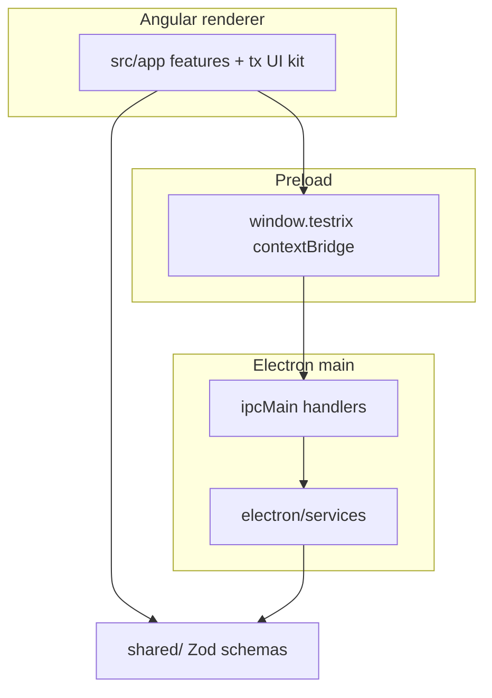

# Architecture

Testrix is a desktop app with three compilation targets that share Zod-backed contracts.

## Layers

| Area | Role |
| --- | --- |
| `src/app/` | Angular UI (`@app/*`). Feature folders under `features/`; reusable widgets under `src/app/shared/`. |
| `electron/` | Main process: windows, IPC, boot, persistence services. |
| Preload | Narrow `contextBridge` API aligned with `electron/electron-api-bridge.ts`. |
| `shared/` | Cross-runtime TypeScript (`@shared/*`): config, session, HTTP helpers, testing schemas. |

## Renderer UI kit vs contracts

| Path | Alias | Purpose |
| --- | --- | --- |
| `src/app/shared/` | `@app/shared` | Angular `tx-*` components, pipes, directives. Components live under category folders (`forms/`, `chrome/`, `overlays/`, `feedback/`, `editors/`, `data/`). |
| `shared/` | `@shared/*` | Zod contracts and pure helpers used by Electron and Angular. Not UI. |

## Security posture (summary)

- `contextIsolation: true`, `nodeIntegration: false`
- CSP applied via `session.defaultSession.webRequest`
- Single-instance lock; splash/error windows stay preload-free

Details: [security.md](security.md).
